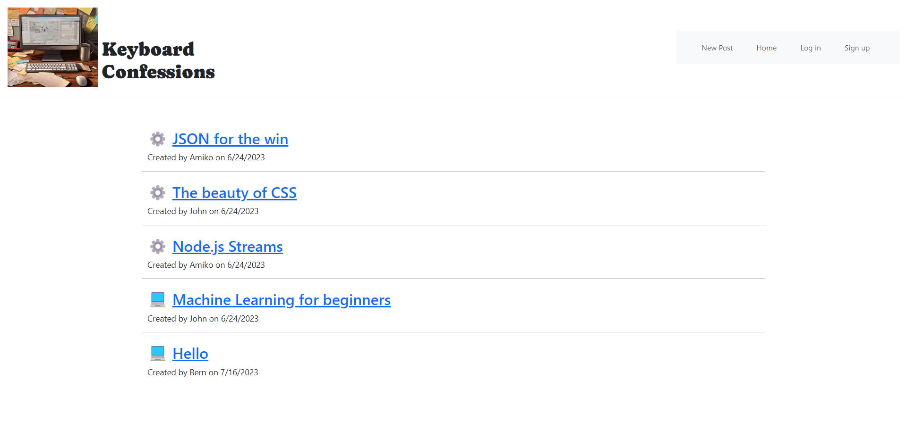

# KeyboardConfessions

  > ## DESCRIPTION
As a new developer, building a CMS-style blog site allows me to not only learn about the technical aspects of web development but also understand the significance of effective communication within the developer community.

This project allows me to explore different technologies and frameworks such as Handlebars.js, Sequelize, and express-session, which are widely used in the industry. By following the Model-View-Controller (MVC) paradigm, I will gain a deeper understanding of architectural structure and maintainability.

Building a blog site from scratch and deploying it to Heroku will provide valuable insights into the entire development lifecycle, from design to deployment. Moreover, enabling features like publishing blog posts and commenting will enhance user interaction and engagement.

Overall, this project allows me to combine technical proficiency with creativity, fostering my growth as a developer and enabling me to make a positive impact within the developer community.

## TABLE OF CONTENTS
  1. [Description](#description)
  2. [Usage](#usage)
  3. [Contributing](#contributing)
  4. [Credits](#credits)
  5. [Tech](#tech)
  6. [License](#license)
  7. [References](#references)
  8. [Questions](#questions)

> ## USAGE
#### Go to my website  [Keyboard Confessions](https://keyboard-confessions-f03f9d1d59cd.herokuapp.com/)
#### Create an account or log in to be able to create posts and add comments to posts. You can view posts and comments without an account.  

> ## CONTRIBUTING
#### If you are interested in contributing to this project, please follow these steps:
- Fork the repo on GitHub
- Clone the project to your own machine
- Commit changes to your own branch
- Push your work back up to your fork
- Submit a pull request for review

> ## CREDITS
#### [Jen Butler](https://github.com/justjenb)

> ## TECH
&nbsp;
&nbsp;
&nbsp;
&nbsp;
&nbsp;
&nbsp;
&nbsp;
&nbsp;

> ## LICENSE
 
Please see the LICENSE file for details

> ## REFERENCES
- Shields.io (https://shields.io/badges)
- UConn Coding Bootcamp - Module 14 MVC Mini Project

> ## QUESTIONS
For any questions, please reach out to me, [Jen Butler](https://github.com/justjenb), via GitHub.